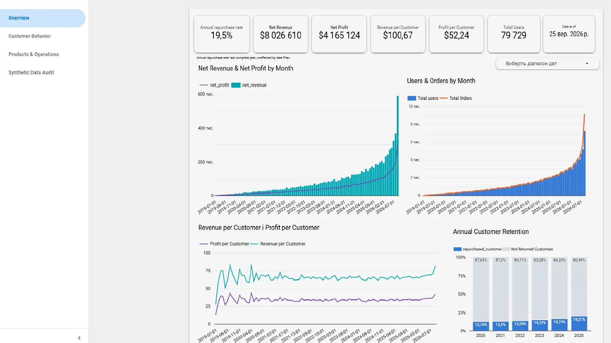
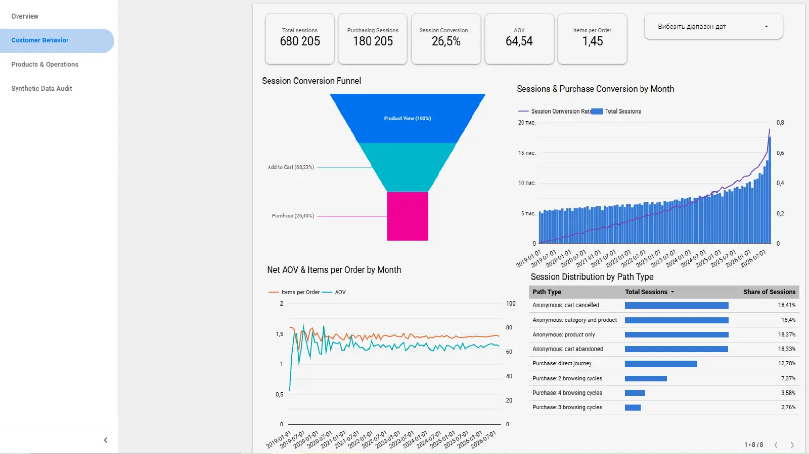
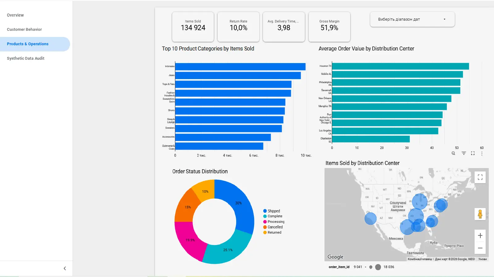
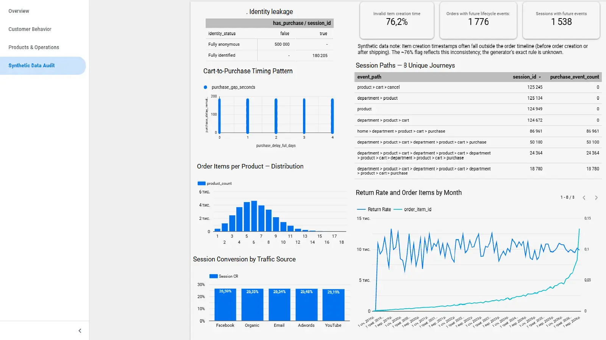

# Дашборд TheLook та аудит синтетичних даних

[Відкрити інтерактивний дашборд у Data Studio](https://datastudio.google.com/reporting/d7ac25c5-f6ff-4ea7-88da-427888fb8a43)

Проєкт побудований на публічному наборі даних `bigquery-public-data.thelook_ecommerce` за допомогою BigQuery і Data Studio. Спочатку я досліджувала користувачів, замовлення й товари, а коли помітила підозріло регулярні закономірності, перевірила дані докладніше. Набір синтетичний: дашборд дає змогу тренувати аналіз, але його результати не варто перетворювати на рекомендації для реального магазину.

## Сторінки дашборду

| Сторінка | Що показує |
| --- | --- |
| Overview | Дохід, прибуток, користувачів і повторні покупки за роками |
| Customer Behavior | Сесії, воронку, конверсію та маршрути подій |
| Products & Operations | Товари, повернення, доставку й розподільчі центри |
| Synthetic Data Audit | Зв’язок ідентифікації з покупкою, закономірності часу, майбутні події та інші особливості синтетичних даних |

Переглянути чотири сторінки (статичні знімки)

Дані в дашборді оновлюються. Зображення показують один із попередніх станів, тому поточні кількості в інтерактивному звіті можуть відрізнятися.

## Запити й визначення метрик

П’ять запитів для дашборду містяться в папці [`sql/`](sql/). У `mart_sessions` один рядок відповідає сесії, у `mart_ecommerce_overview` — позиції замовлення. Ці дві вітрини створюються першими. `mart_funnel` читає `mart_sessions`, `mart_annual_repurchase` — `mart_ecommerce_overview`, а `audit_product_distribution` звертається безпосередньо до публічної таблиці `order_items`.

| Метрика | Як розраховується |
| --- | --- |
| Purchasing Sessions | Сесії з подією `purchase`; обчислюване поле `purchase_session_flag` дорівнює 1 для таких сесій і 0 для решти. |
| Session Conversion | Кількість сесій із покупкою, поділена на всі сесії у вибраному періоді. |
| Orders | Кількість унікальних `order_id`. |
| Items Sold | Кількість унікальних `order_item_id` з фільтром `is_non_cancelled_non_returned = TRUE`. Такий самий фільтр діє на графіки проданих позицій за категоріями й розподільчими центрами. |
| Funnel | Кількість сесій із подіями `product`, `cart` і `purchase` на відповідних кроках. Запит перевіряє наявність цих подій, але окремо не перевіряє їхній порядок. |
| Annual Repurchase Rate | Частка користувачів із нескасованим замовленням у певному році, які також мали таке замовлення наступного року. Повернені замовлення не виключаються; це не показник утримання когорти за роком першої покупки. |
| Product Distribution | Розподіл кількості рядків `order_items` за `product_id` для всіх статусів. Товари без жодної позиції замовлення сюди не потрапляють. |

На перевірених зрізах нефільтровані кількості сесій із покупкою, подій покупки та позицій замовлень збігалися. Це **різні сутності**, і рівність підсумків сама собою не доводить зв’язку «один до одного» між записами. Метрика Items Sold після фільтрації статусів має інше значення.

## Що виявив аудит

- У досліджених даних сесії з відомим `user_id` завершувалися покупкою, а повністю анонімні — ні. Тому використання ідентифікатора для прогнозування покупки призвело б до витоку інформації про результат.
- Спостережені сесії складалися лише з восьми маршрутів подій, чотири з яких завершувалися покупкою. Воронка відображає ці згенеровані сценарії, а не вільну поведінку покупців.
- Проміжок між `cart` і `purchase` складався з 0–4 повних днів і 0–179 секунд. Точні межі — частина виявленої закономірності, але механізм генератора нам невідомий.
- Приблизно три чверті значень `order_items.created_at` на перевірених зрізах суперечили хронології замовлень. Для `order_date` у вітрині використано `orders.created_at`, а вихідні часові мітки позицій залишено для перевірок.
- Деякі статуси вже відображають відправлення, доставку чи повернення, часові мітки яких ще в майбутньому. Показники, пов’язані з поточною датою, змінюються з плином часу.
- Конверсії каналів на перевірених зрізах були близькими до 26–27%, а частка повернень за розглянутими категоріями й центрами — приблизно 9–12%. Це опис синтетичних даних, а не доказ однакового впливу каналів чи категорій у реальному бізнесі.

Вихідні дослідницькі запити в папці [`sql/checks/`](sql/checks/) перевіряють унікальність ключів, приєднання таблиць, пропущені назви, узгодженість статусів, ціни, собівартість і часові послідовності. Деякі `JOIN` повторюються, щоб перевірки можна було запускати окремо. Перед використанням поточних чисел запити варто виконати знову.

## Як відтворити

1. У BigQuery використати Standard SQL і публічні таблиці `bigquery-public-data.thelook_ecommerce`.
2. Виконати `mart_sessions.sql` та `mart_ecommerce_overview.sql` як запити або зберегти їх як представлення, додавши на початку `CREATE OR REPLACE VIEW` зі своїми назвами проєкту, набору даних і представлення.
3. У `mart_funnel.sql` і `mart_annual_repurchase.sql` замінити `YOUR_PROJECT.YOUR_DATASET` на набір даних із першими двома представленнями, а потім створити ці представлення. `audit_product_distribution.sql` читає публічну таблицю безпосередньо.
4. Підключити джерела до Data Studio, налаштувати обчислювані поля й фільтри графіків, описані вище. Інструкції в `sql/checks/` запускати окремими запитами.

SQL зберігає логіку наданих робочих запитів; прибрано лише символи екранування, які з’явилися під час копіювання з Markdown. Зображення отримано з PDF фінального дашборду.
